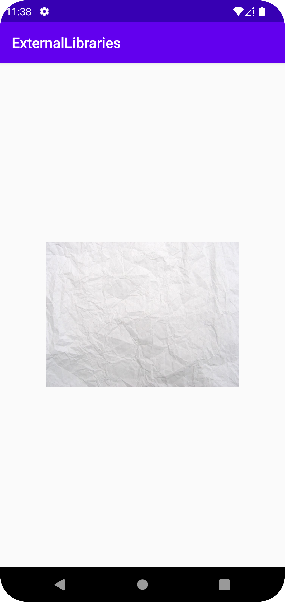

# Assignment 8: External libraries (for VG only)

## Add Library
Added Library inside gradle by changing the repositories and implement the libary inside
the gradle files to apply the library to the application. To be available to load a picture by an url
the application needs to have internet permission that is being added inside the android manifest.

## Used inside Application
To use the library a imageview is needed to locate the picture. To add the picture from the webburl.
We first need to tell what component we want to use. We identify the id of the object. 
We create a variable with a string value to access the specific url. 
We use Glide pointing against the page we want to send the content. In this case to MainActivity.
We use .load() to load the variable that correspond the specific url we want to use, and then 
.into to show what component we want to paste the loaded content into.

```
allprojects {
    repositories {
        mavenCentral()
        google()
        
    }
}
```
_Changed Repositories_

```
    implementation 'com.github.bumptech.glide:glide:4.4.0'
    annotationProcessor 'com.github.bumptech.glide:compiler:4.4.0'
```
_Implemented Glide Library_

```xml
<manifest xmlns:android="http://schemas.android.com/apk/res/android"
    package="com.example.externallibraries">
    <uses-permission android:name="android.permission.INTERNET" />
</manifest>
```
_Internet Permission_

```xml
<ImageView
    android:id="@+id/imageView"
    android:layout_width="266dp"
    android:layout_height="271dp"
    app:layout_constraintBottom_toBottomOf="parent"
    app:layout_constraintEnd_toEndOf="parent"
    app:layout_constraintStart_toStartOf="parent"
    app:layout_constraintTop_toTopOf="parent"
    tools:srcCompat="@tools:sample/avatars" />
```
_ImageView_

```java
public class MainActivity extends AppCompatActivity {

    ImageView imageView;

    @Override
    protected void onCreate(Bundle savedInstanceState) {
    super.onCreate(savedInstanceState);
    setContentView(R.layout.activity_main);
    imageView = findViewById(R.id.imageView);
    String url = "https://wallpaperaccess.com/full/1971371.jpg";
    Glide.with(MainActivity.this)
    .load(url)
    .into(imageView);
    }
    }
```
_Insert Image from url_

